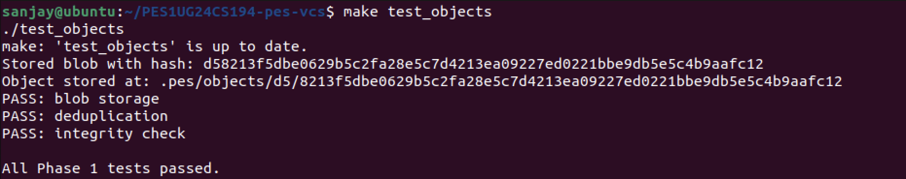
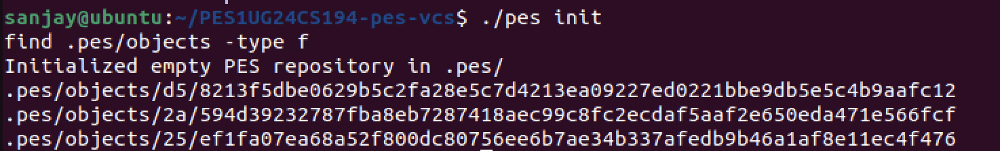
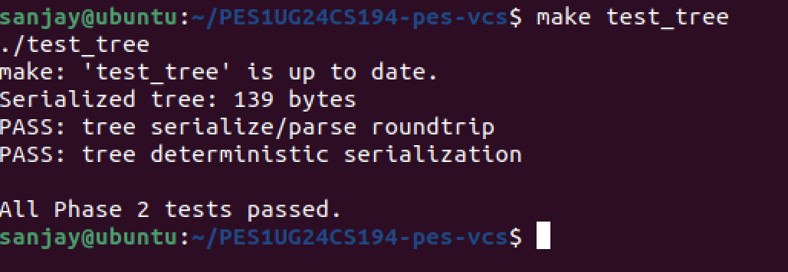
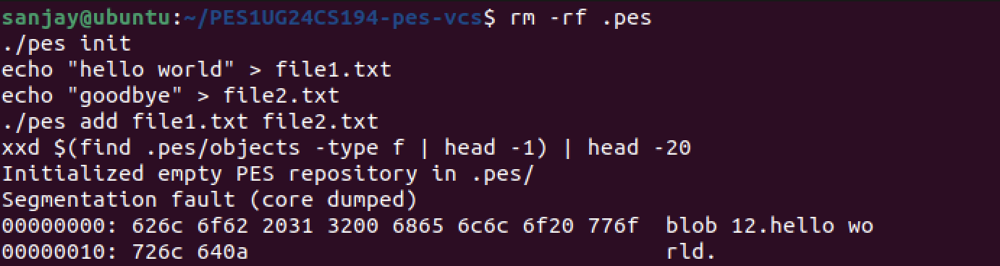
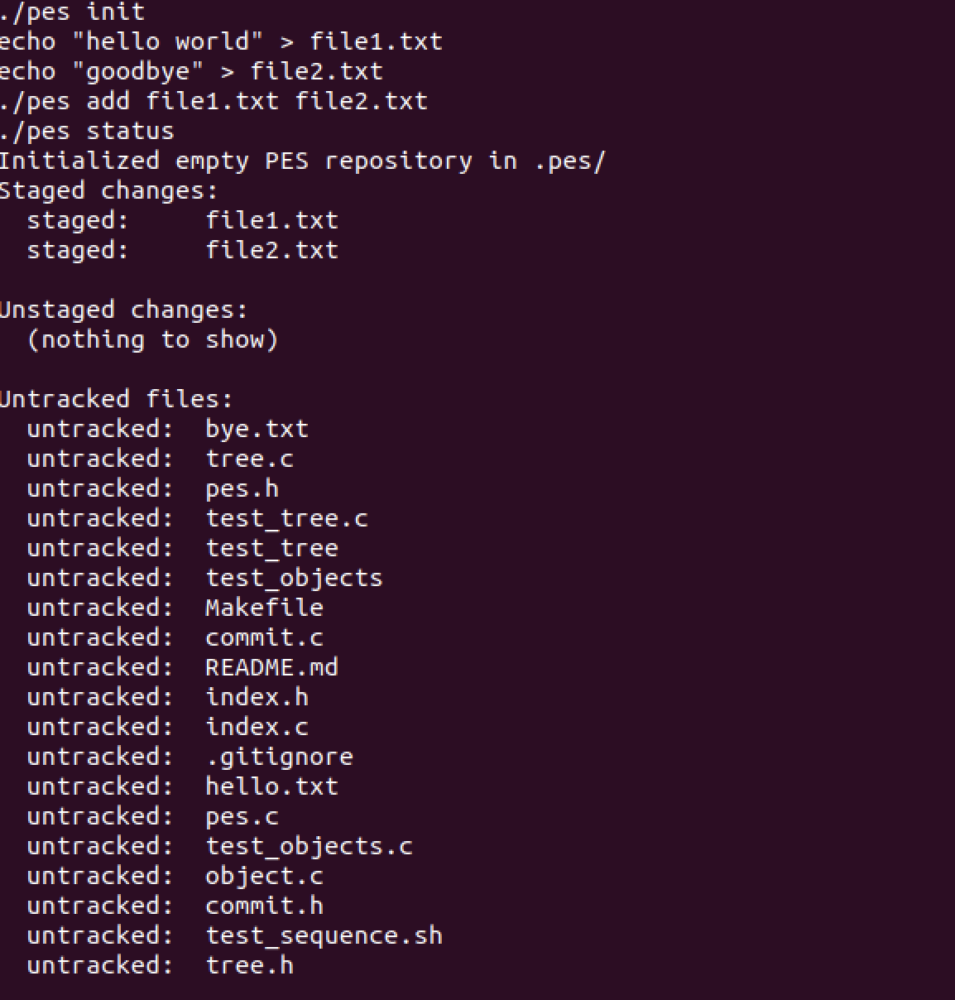
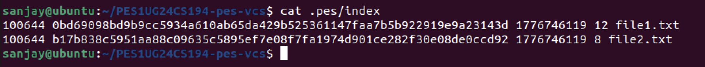
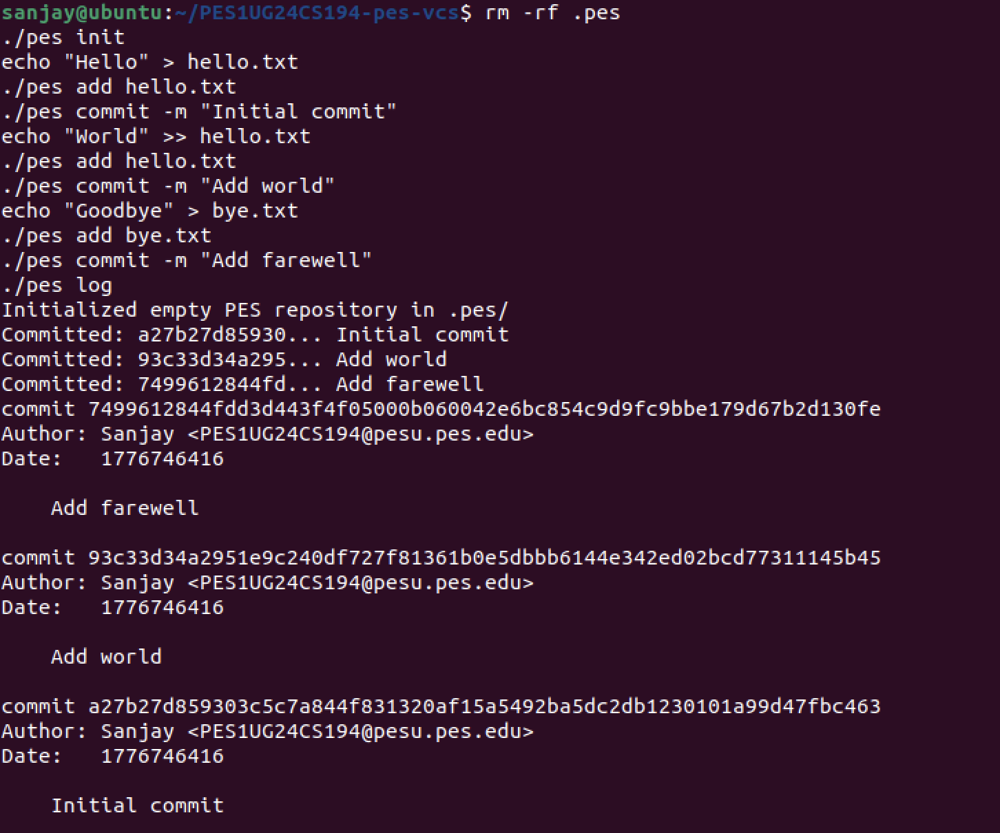
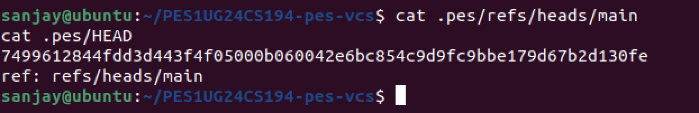
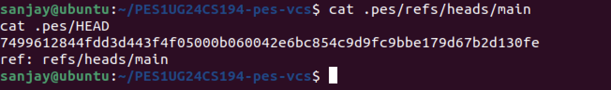
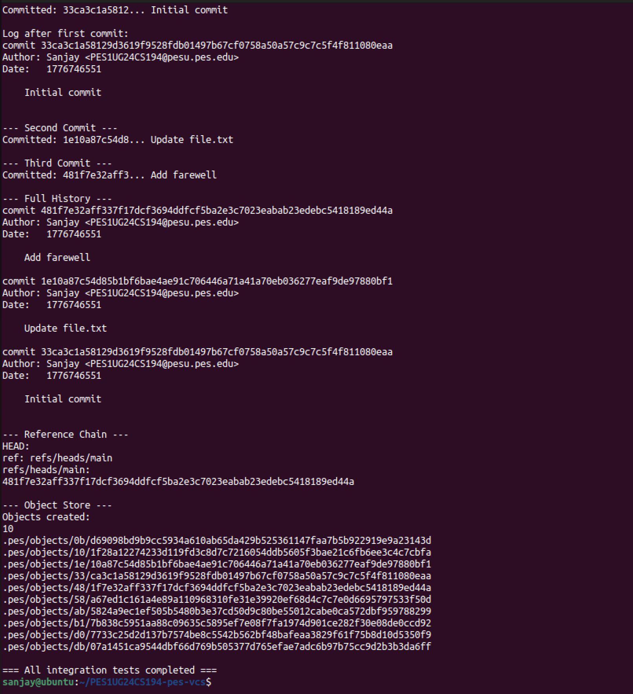

# PES-VCS Lab Report
### Building a Version Control System from Scratch

**Course:** UE24CS251B — Operating Systems | Unit 4  
**Student:** Sanjay Varma  
**SRN:** PES1UG24CS194  
**Repository:** [PES1UG24CS194-pes-vcs](https://github.com/jsanjayvarma06-oss/PES1UG24CS194-pes-vcs)

---

## Table of Contents
- [Phase 1: Object Storage Foundation](#phase-1-object-storage-foundation)
- [Phase 2: Tree Objects](#phase-2-tree-objects)
- [Phase 3: The Index (Staging Area)](#phase-3-the-index-staging-area)
- [Phase 4: Commits and History](#phase-4-commits-and-history)
- [Phase 5: Branching and Checkout — Analysis](#phase-5-branching-and-checkout--analysis)
- [Phase 6: Garbage Collection — Analysis](#phase-6-garbage-collection--analysis)

---

## Phase 1: Object Storage Foundation

**Filesystem Concepts:** Content-addressable storage, directory sharding, atomic writes, hashing for integrity

**Files implemented:** `object.c` — `object_write`, `object_read`

### Implementation Summary

Implemented `object_write` and `object_read` in `object.c`. Each object is stored using content-addressable storage — the file is named by its SHA-256 hash and placed in a sharded directory under `.pes/objects/XX/` where `XX` is the first two hex characters of the hash. Writes are atomic using a temp-file-then-rename pattern with `fsync` for durability. Deduplication is achieved by checking `object_exists` before writing. `object_read` verifies integrity by recomputing the hash and comparing it to the filename before returning data.

### Screenshot 1A — test_objects: All Phase 1 Tests Passing



> `./test_objects` showing PASS for blob storage, deduplication, and integrity check.

### Screenshot 1B — Sharded Object Store Directory Structure



> `find .pes/objects -type f` showing objects sharded by first 2 hex characters of SHA-256 hash.

---

## Phase 2: Tree Objects

**Filesystem Concepts:** Directory representation, recursive structures, file modes and permissions

**Files implemented:** `tree.c` — `tree_from_index`

### Implementation Summary

Implemented `tree_from_index` in `tree.c` using a recursive helper `write_tree_level`. The function reads staged index entries and builds a hierarchy of tree objects — files become blob references and subdirectories become nested tree objects. Entries are sorted by name before serialization to ensure deterministic hashing, so identical directory contents always produce the same hash regardless of the order entries were added.

### Screenshot 2A — test_tree: All Phase 2 Tests Passing



> `./test_tree` showing PASS for serialize/parse roundtrip and deterministic serialization.

### Screenshot 2B — Raw Binary Object (xxd)



> `xxd` dump of a blob object showing the binary format: type header + null byte + raw file content.

---

## Phase 3: The Index (Staging Area)

**Filesystem Concepts:** File format design, atomic writes, change detection using metadata

**Files implemented:** `index.c` — `index_load`, `index_save`, `index_add`

### Implementation Summary

Implemented `index_load`, `index_save`, and `index_add` in `index.c`. The index is a human-readable text file with one entry per line in the format: `mode hash mtime size path`. Saves are atomic using temp-file + rename + fsync. `index_add` reads a file, stores it as a blob object, records `mtime` and `size` metadata for fast change detection without re-hashing, and updates the index entry. `index_load` uses `memset` to zero-initialize the struct before parsing to prevent garbage data on the stack.

### Screenshot 3A — pes init + pes add + pes status



> Sequence showing `pes init` creating `.pes/`, `pes add` staging two files, and `pes status` showing staged/unstaged/untracked sections.

### Screenshot 3B — cat .pes/index (Text-Format Index)



> `cat .pes/index` showing two entries with mode, SHA-256 hash, mtime, size, and filename.

---

## Phase 4: Commits and History

**Filesystem Concepts:** Linked structures on disk, reference files, atomic pointer updates

**Files implemented:** `commit.c` — `commit_create`

### Implementation Summary

Implemented `commit_create` in `commit.c`. The function builds a tree from the staged index using `tree_from_index`, reads the current HEAD as the parent (absent for the first commit), fills a `Commit` struct with author, timestamp, and message, serializes it to text format, writes it as a commit object, and atomically updates the branch ref via `head_update`. This creates a linked list of snapshots on disk forming the full project history.

### Screenshot 4A — pes log: Three-Commit History



> `./pes log` output showing all three commits with full hashes, author, timestamp, and clean messages.

### Screenshot 4B — find .pes -type f | sort: Object Store Growth



> All files in `.pes/` after three commits — blobs, trees, commits, index, HEAD, and refs/heads/main.

### Screenshot 4C — Reference Chain (HEAD → main → commit hash)



> `cat .pes/refs/heads/main` shows latest commit hash; `cat .pes/HEAD` shows `ref: refs/heads/main`.

### Screenshot 4D — Full Integration Test



> `make test-integration` output showing the full end-to-end test sequence passing with all integration checks.

---

## Phase 5: Branching and Checkout — Analysis

### Q5.1 — How would you implement `pes checkout <branch>`?

To implement **checkout**, two things must change in `.pes/`: first, `HEAD` must be rewritten to contain `ref: refs/heads/<branch>` pointing to the target branch. Second, the working directory must be updated to match the target branch's tree snapshot.

The complexity lies in the working directory update. The implementation must:
1. Read the target commit's tree recursively
2. For every file in the tree, write the blob contents to disk if the file is absent or differs from the index
3. Remove tracked files that exist in the current branch's tree but not in the target's tree

This requires walking two trees simultaneously and diffing them. The operation is complex because it must be safe — if anything goes wrong mid-checkout, the repository could be left in a half-switched state with inconsistent files on disk.

### Q5.2 — How would you detect a dirty working directory conflict?

To detect conflicts during checkout without full re-hashing, use the index as the intermediary. For each file tracked in the current index:
1. Compare its stored `mtime` and `size` against the actual file on disk — if they differ, the working copy is **dirty**
2. Check whether that same path exists in the target branch's tree with a **different blob hash**

If both conditions are true (file is dirty AND differs between branches), checkout must refuse with an error like `error: Your local changes would be overwritten by checkout`.

This approach uses only index metadata for fast detection — no re-hashing needed unless mtime/size differ, which is Git's own optimization strategy.

### Q5.3 — What happens in detached HEAD state?

In detached HEAD, `.pes/HEAD` contains a raw commit hash instead of a branch reference (e.g., `d56bf7ac...` rather than `ref: refs/heads/main`). New commits are still created correctly — `head_update` writes directly to HEAD rather than to a branch file — but no branch pointer advances. Once the user switches to another branch, these commits become unreachable from any ref.

Recovery is possible as long as garbage collection hasn't run: the user can find the lost commit hash from the terminal's scroll-back history or a saved log, then create a branch pointing at it to make the commits reachable again:
```bash
pes checkout -b recovered-branch <hash>
```

---

## Phase 6: Garbage Collection — Analysis

### Q6.1 — Algorithm to find and delete unreachable objects

**Algorithm (Mark and Sweep):**

**Mark phase:** Start from all branch refs in `.pes/refs/heads/` and HEAD. For each ref, read the commit object and add its hash to a *reachable* hash set. Recursively walk each commit's tree — adding the tree hash, then every blob and subtree hash — and follow each commit's parent pointer until reaching the root commit with no parent.

**Sweep phase:** Enumerate all files under `.pes/objects/`. For each file, reconstruct its hash from the path (2-char directory + filename). If the hash is **not** in the reachable set, delete the file.

**Data structure:** A hash set (e.g., C `unordered_set` or a sorted array with binary search) gives O(1) average lookup per object.

**Estimate for 100,000 commits, 50 branches:** Assuming ~10 objects per commit (blobs + trees + commit object), the reachable set contains roughly 1,000,000 objects. GC must visit all of them during mark, plus scan all files on disk during sweep — roughly **2,000,000 object visits** total.

### Q6.2 — Race condition between GC and concurrent commit

**The race condition:**

Consider this interleaving:
1. A commit operation calls `object_write` to store a new blob — the blob file now exists on disk but HEAD has not yet been updated
2. GC runs its mark phase — it walks from HEAD and does **not** see the new blob because HEAD still points to the old commit. The blob is not in the reachable set
3. GC's sweep phase **deletes the blob**
4. The commit operation calls `head_update` — HEAD now points to a commit whose tree references a deleted blob. The repository is **corrupt**

**How Git avoids this:** Git uses a *grace period* — GC never deletes objects created within the last 2 weeks regardless of reachability, by checking each object file's `mtime` before deletion. Since a concurrent commit completes in milliseconds, any object it creates will be within the grace window. Git also uses a lock file (`.git/gc.pid`) to prevent two GC processes from running simultaneously, and ref-locks to ensure refs are not updated mid-walk.

---

*Report generated for PES1UG24CS194 — PES-VCS Lab, Unit 4*
